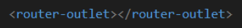
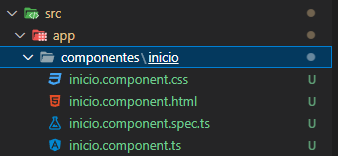
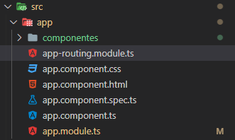
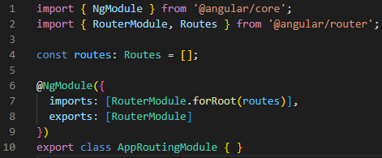
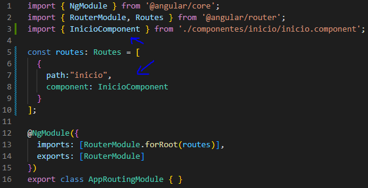
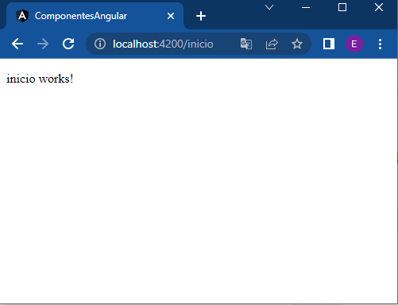

# Crearndo un Componente y Vincular con rutas en ANGULAR

Al finalizar esta guía, podras crear componentes y vincularlos con las rutas en Angular
<br>
Antes de comenzar, Necesitas tener instalado todas las dependencias y tener en cuenta todos los requisitos para crear un proyecto en angular:
```
1. Instalar NodeJs
2. Instalar Angular Cli
3. Crear un proyecto en Angular
4. Eliminar todo el HTML de app.component.html y dejar solamente: <router-outlet></router-outlet> como muestra la iamgen siguiente
```


### Creando un componente en Angular 🔧

Vamos a crear nuestro primer componente. Para esto debemos ejecutar un comando de Angular. <br>
Antes de crear el componente, debemos posicionarnos dentro de nuestro proyecto (raíz de la carpeta que contiene todos nuestros directorios de Angular)<br>
Una vez estemos en la raíz de nuestro directorio, vamos a ejecutar el siguiente comando en la terminal para crear nuestro primer proyecto llamado <b>Inicio</b>:

```
ng generate component componentes/inicio
```
donde:
```
ng: usamos la consulta de angular
generate: indicamos que vamos a generar algo
component: indicamos que lo que vamos a generar es un componente
componentes/inicio: indicamos que vamos a crear el componente inicio dentro de una carpeta llamada componentes
```
Una vez ejecutado el comando anterior, obtendremos como salida:
```
CREATE src/app/componentes/inicio/inicio.component.html (21 bytes)
CREATE src/app/componentes/inicio/inicio.component.spec.ts (599 bytes)
CREATE src/app/componentes/inicio/inicio.component.ts (275 bytes)     
CREATE src/app/componentes/inicio/inicio.component.css (0 bytes)      
UPDATE src/app/app.module.ts (493 bytes)
```
En el cual indica que se crearon tres archivos (.html, .spec.ts, .ts y .css) y se actualizó un archivo _(app.module.ts, el cual contiene las configuraciones del componente recien creado y lo deja disponible para ser utilizado en nuestro proyecto)_
<br>
Y en nuestro proyecto se visualiza lo recientemente creado en el directorio src->app->componentes:<br>

### Usando Rutas en Angular para el componente <b>inicio</b> 🔧
Las rutas de angular, nos sirve para dar una dirección específica a un component. Esta dirección entregada en la ruta de angular, es visible por el navegador escribiendo la dirección del sitio web + la ruta entregada. <br>
Entonces. Si queremos entregar una ruta al componente <b>inicio</b> debemos dirigirnos a:

```
src->app->app-routing.module.ts
```
Como muestra la siguiente imagen: <br>


Al abrir el archiv: app-routing.module.ts. Nos mostrará el contenido de este, en el cual debemos agregar nuestro componente inicio y agregarlo dentro de las [] de la instrucción <b>Routes = []<b><br>

<b>Sin el componente</b>

<br>
<b>Con el componente Inicio Agregad0</b>

<br>
Lo que se agregó fue:
```
import { InicioComponent } from './componentes/inicio/inicio.component';

{
    path:"inicio",
    component: InicioComponent
}
```
Donde:
```
import: Importa el componente creado.
path: agregar un nombre de ruta para acceder al componente.
component: indicamos a que compoente vamos asignar la ruta de path.
```
Ahora podemos visualizar nuesto componente recientemente creado en nuestro navegador Web escribiendo la siguiente ruta:<br>
```
http://localhost:4200/inicio
```
Donde:
```
localhost:4200: Es nuestra dirección Web de nuestro proyecto angular.
/inicio: es la ruta agregada a nuestro componente inicio en el path.
```

Visualizando el compoennte en el navegador:<br>


📢 _Hemos creado nuestro primer componente_
😊😊😊😊😊

"inicio work!" se encuentra en el archivo html del componente inicio creado anteriormente. Este se puede cambiar y localizar en: 
```
src->app->componentes->inicio->inicio.component.html
```

### 🤓 ACTIVIDAD: Crea un componente llamado <b>contacto</b> 🤓
Crea tu segundo componente llamado <b>contacto</b> y llamalo "contacto". Este debe visualizarse por eñ navegador teniendo la siguiente ruta:
```
http://localhost:4200/contacto
```
